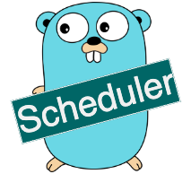

# Delay Box


[](https://github.com/ehsaniara/scheduler/actions/workflows/go.yml)


<p align="center">
  
</p>

Delay Box is a High Throughput Distributed Task Scheduler. It is an advanced system designed to manage and execute a vast number of tasks across a distributed network of servers. 
Built on top of the **Redis** database, it leverages Redis's high-speed in-memory data store for quick access and efficient task management. 


* This scheduler ensures optimal performance and reliability by utilizing protobuf for efficient data serialization and gRPC for robust communication between services. 
* It features intelligent load balancing, dynamic scaling, and fault tolerance to handle high volumes of concurrent tasks without bottlenecks. 
* Additionally, the system offers the flexibility to integrate with **Kafka**, enabling seamless event streaming and message queuing for enhanced data processing capabilities. 
* One of the standout features of this application is its easy horizontal scalability, allowing it to grow and adapt to increasing workloads effortlessly by adding more servers to the network. 
* Equipped with sophisticated algorithms for task prioritization and resource allocation, this scheduler ensures that critical tasks are executed promptly.

# Use-Case

It is ideal for applications requiring massive parallel processing capabilities, such as data processing pipelines, large-scale simulations, and real-time analytics.

Set Task
```shell
curl -X POST http://localhost:8088/task -H "Content-Type: application/json" -d '{"executionTimestamp":1720285291097,"pyload":"VGVzdCBKYXkK", "taskType":"PUB_SUB"}'
```

to Get list of pending tasks (First 100 tasks)
```shell
curl "http://localhost:8088/task?offset=100&limit=0"
```


# General Architecture

<p align="center">
  
</p>
