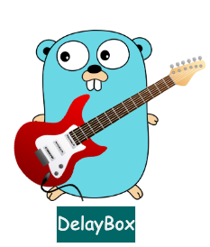
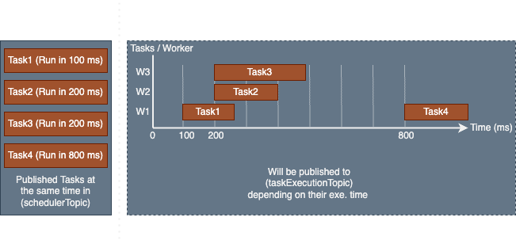

# DelayBox


[](https://github.com/ehsaniara/delay-box/actions/workflows/go.yml) [](https://goreportcard.com/report/github.com/ehsaniara/delay-box)


<p align="center">
  
</p>

**DelayBox** is a High Throughput Distributed **ONE-TIME** Task Scheduler ⚡. It is an advanced system designed to manage and execute a vast number of tasks across a distributed network of servers with **sub-second accuracy**. Built on top of the **Redis** database, it leverages Redis's high-speed in-memory data store 🔥 for quick access and efficient task management.

DelayBox utilizes protobuf internally at Redis and topics.

## General Idea

Delay box is consist of 2 topics (`Scheduler` and `Executer`)
<p align="center">
  
</p>

🎨 DelayBox also includes a centralized task delay mechanism, allowing precise control over task execution timings, which is critical for workflows requiring synchronized or delayed task processing. Additionally, the system offers the flexibility to integrate with **Kafka**, enabling seamless event streaming and message queuing for enhanced data processing capabilities.

🎨 One of the standout features of this application is its easy horizontal scalability, allowing it to grow and adapt to increasing workloads effortlessly by adding more servers to the network. Equipped with sophisticated algorithms for task prioritization and resource allocation, this scheduler ensures that critical tasks are executed promptly.


# Use-Case

🚀 This tool simplifies the workflow for niche task execution by removing the need to write code to handle Redis and Kafka development complexities. It manages these tasks for you through straightforward REST calls.

✅ It is ideal for applications requiring massive parallel processing capabilities, such as data processing pipelines, large-scale simulations, and real-time analytics.

<p align="center">
  
</p>

# Examples
## Docker Compose

### 3 Worker Nodes with Kafka

clone the project 
```shell
cd docker-multi-worker
docker-compose -f docker-compose.yml up -d
```
Wait until all worker nodes are up and running (you'll see in their console: "🚀 scheduler is ready!"). Then run the following command to create 1000 tasks which designed to execute in 10 second. (tasks just simply print the date in the worker nodes console)

```shell
sh ./create-task.sh
```
**Note:** your terminal console will only print  `{"message":"task created"}` 1000 times, but the worker consoles shows the date. (in this example its docker logs)

You can try the docker compose example with 3 worker nodes example [docker-compose example with kafka](./docker-multi-worker) 

### 3 Worker Nodes 

Keep in mind that in this setup Delay-Box gets advantage og redis pub sub, so you are limited to single Redis node.

clone the project
```shell
cd docker-multi-worker-no-kafka
export COMPOSE_PROJECT_NAME=delay-box
docker-compose -p delay-box -f docker-compose.yml up -d
```
Wait until all worker nodes are up and running (you'll see in their console: "🚀 scheduler is ready!"). Then run the following command to create 1000 tasks which designed to execute in 10 second. (tasks just simply print the date in the worker nodes console)

```shell
sh ./create-task.sh
```
**Note:** your terminal console will only print  `{"message":"task created"}` 1000 times, but the worker consoles shows the date. (in this example its docker logs)

You can try the docker compose example with 3 worker nodes example [Docker-compose example without kafka](./docker-multi-worker-no-kafka)


## Local Example

Following task is type of `SHELL_CMD` which mean it will execute at any defined worker nodes on the given timestamp, (Payload is just the OS Date command)
```shell
curl -X POST http://localhost:8088/task  \
  -H "Content-Type: application/json" -d \
  '{"parameter":{"executionTimestamp":"1720672590913","taskType":"SHELL_CMD"},"pyload":"ZGF0ZQ=="}'
```

To Get list of pending tasks (First 100 tasks)
```shell
curl "http://localhost:8088/task"
```

### pyload
This fild is stored as byte format and published in kafka topic `taskExecutionTopic`


### parameter

| parameter name     | type   | required | description                                                                                                  |
|--------------------|--------|----------|--------------------------------------------------------------------------------------------------------------|
| taskType           | string | YES      | Defines the task type [Type of task](#taskType)                                                              |
| executionTimestamp | number | NO       | With this parameter, the task is expected to be executed at the specified Unix epoch time (in milliseconds). |
| delay              | number | NO       | With this parameter, to delay task execution in millisecond.                                                 |

**Note:** If neither `executionTimestamp` nor `delay` is provided, the task will be executed immediately.


### taskType

| name      | description                                                                                                                                                                                                                                                                                                                 |
|-----------|-----------------------------------------------------------------------------------------------------------------------------------------------------------------------------------------------------------------------------------------------------------------------------------------------------------------------------|
| PUB_SUB   | This type is the basic schedule task, which you just publish payload in kafka topic `schedulerTopic` and  the payload will be published kafka topic `taskExecutionTopic` when its scheduled to be executed. <br/>**Note:** `schedulerTopic` and `taskExecutionTopic` are already configured in the application config file. |
| SHELL_CMD | In this type, your payload, which is a Linux command, will be executed. <br/>**Note:** If you expect to run any application, it must be pre-installed on the worker machine prior to task execution.                                                                                                                        |


# General Architecture

<p align="center">
  
</p>


## Enable Kafka

To enable kafka support add the following config.
```shell
kafka:
  enabled: true
  brokers: localhost:9092
  group: scheduler
  schedulerTopic: Scheduler
  taskExecutionTopic: TaskExecution
```
